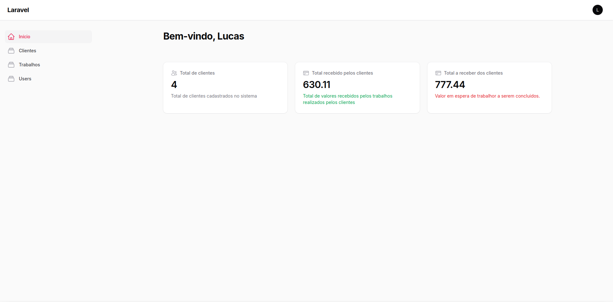

# CRM laravel + filament

Tem os **usuários** comuns do laravel, **clientes** e **trabalhos**. Cada cliente pode ser asociado a mais de um trabalho.

Widgets na página principal.

Próximos passos:

# 1. Migration adicionando relação do Usuário com trabalho e cliente
- Fazer com que cada usuário tenha seus próprios
    - Clientes ✅
    - Trabalhos ✅
    - ~~Filhos de santo~~
> Filho de santo fazer por último? Já que é a terceira taks

# 2. Criar parte de consulta (Serviços)
- Utilizar vídeo que o Rodrigo mandou para
    - Modelar o banco de dados com migrations e models
    - Fazer conexão para buscar os clientes e fazer com que um cliente seja dono de uma consulta
    - Atualizar o form

## 2.1 Pensamentos
    - Como irei marcar início da consulta e data de retorno? 
    - Como Separar as consultas já realizadas? Check de finalizado?

# 3. Criar parte interna do terreiro
- Cadastro de membros (filhos de santo)
    - nome
    - idade (data de nascimento)
    - email
    - telefone
    - detalhes falando sobre

# 4. Estrutura de equipes
- Cada usuário pode pertencer a uma equipe e as equipes possam ter múltiplos usuários.
[link](https://chatgpt.com/c/672e406b-e854-8013-82d4-bef871f2c6a9)

